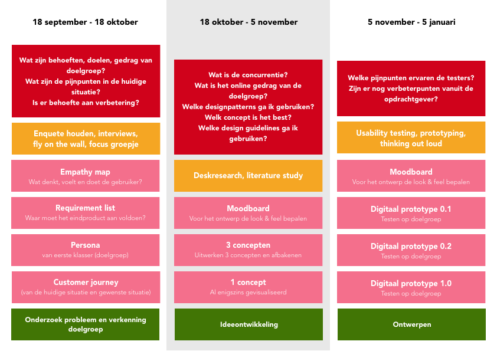

# 1.2 Planning

### Drie delen

In mijn planning heb ik het project opgedeeld in drie delen. Het eerste deel zal voornamelijk gericht zijn op het in kaart brengen van de huidige situatie, mijn doelgroep in kaart brengen en probleemvalidatie. 

Het tweede deel zal gericht zijn op ideeontwikkeling. Ook zal ik mij hier richten op de concurrentie en alles wat betrekking heeft tot de ontwikkeling van mijn concept. Ook zal ik hier al beginnen met het bedenken van verschillende concepten en dit afbakenen tot één concept. 

In het laatste deel ga ik mijn prototype uitwerken en usability testen afnemen. Ik wil relatief gezien vrij snel een eerste prototype af hebben, zodat ik zo vaak mogelijk kan testen. Ik vind dit een effectieve manier van werken omdat je zo continu in contact blijft met de gebruiker. Ik wil ervoor zorgen dat mijn gebruiker zich zo goed mogelijk terug kan vinden in mijn product. 

