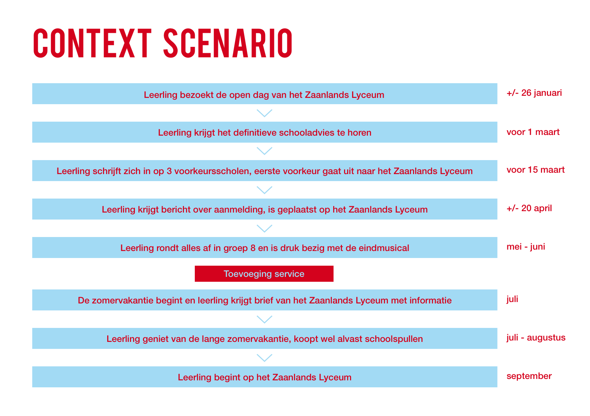

# 2.5 Context scenario

### Inleiding

Op basis van de informatie die ik heb verkregen uit de enquetes en het expertinterview heb ik een context scenario opgesteld. Dit heb ik gedaan om de huidige situatie in kaart te brengen. Het leek mij vooral handig om bij elke stap in het scenario data te vermelden zodat het tijdsbestek ook goed in kaart wordt gebracht. Het scenario loopt vanaf het moment dat de leerling een bezoek brengt aan de open dag \(januari\) tot de eerste schooldag op het Zaanlands Lyceum \(september\). Mijn oplossing zal plaatsvinden tussen het moment dat de leerling alles afrondt in groep 8 \(juni\) en zal wellicht kunnen duren tot de eerste maand in de brugklas \(oktober\). Ook dit is in het context scenario opgenomen.

  

