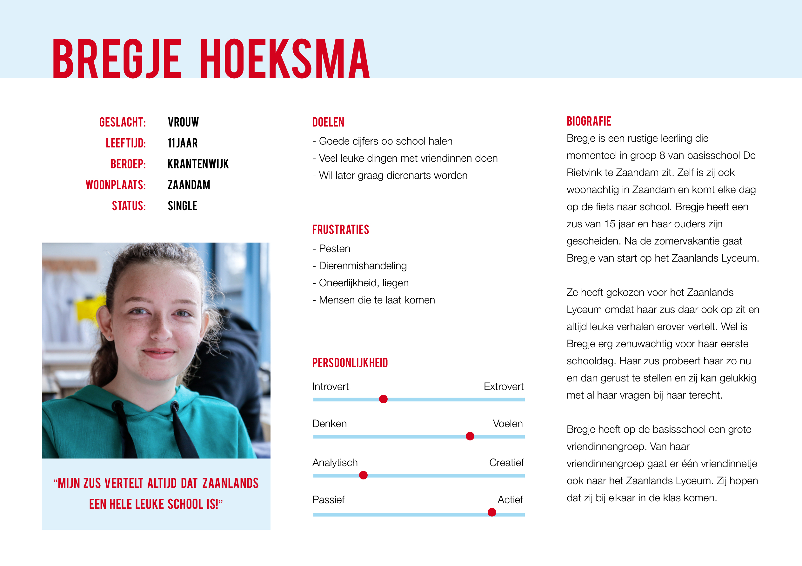

# 2.6 Persona doelgroep

### Inleiding

Om een goed beeld te krijgen van mijn doelgroep heb ik een persona opgesteld. Door een persona op te stellen krijg je een beter beeld van de gebruiker. Het persona heb ik opgesteld op basis van de resultaten van [de afgenomen enquete](3.1-enquete-18-september-2018.md), het [expertinterview](untitled-3.md) en van het bezoek wat ik heb gebracht aan het Zaanlands Lyceum \([observatie en in gesprek met de doelgroep](untitled-2.md)\). Het persona zal er voor zorgen dat ik in de rest van mijn ontwerpproces een duidelijk beeld heb van de toekomstige gebruiker.

