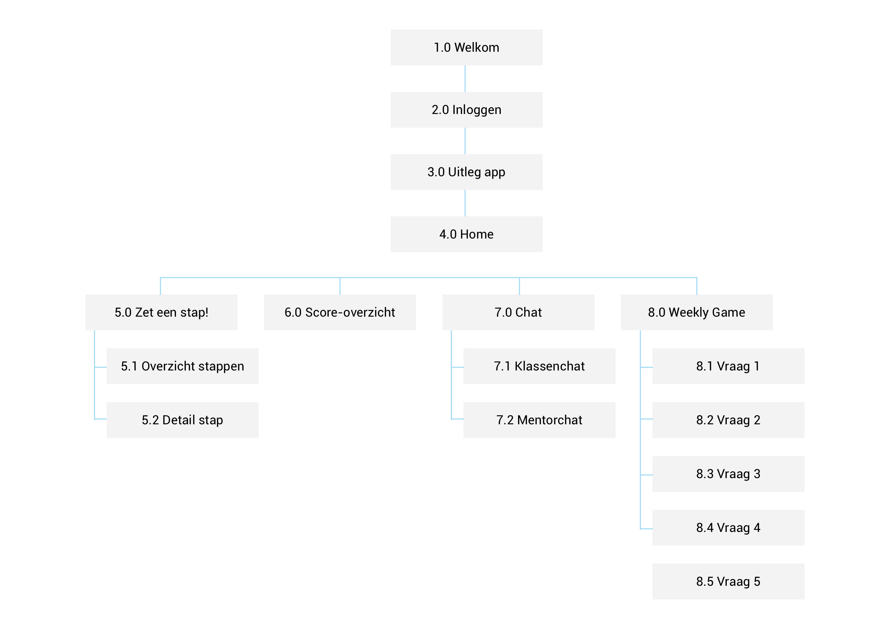

# 3.5 Sitemap 0.5

Op basis van alle onderzoeksresultaten en de [eerste versie van het concept](5.1-eerste-versie-concept.md) heb ik de eerste versie van de sitemap opgesteld waarin alle pagina's en hun bijbehorende functies worden weergegeven. Een sitemap zorgt voor structuur en is cruciaal tijdens het ontwerpproces. Onderaan de pagina is er per pagina een toelichting te vinden. 

## Pagina's en bijbehorende functies

### 1.0 Welkom

Het welkomstscherm is het eerste scherm wat de gebruiker ziet. Op het scherm is het logo van de app te zien en het logo van het Zaanlands Lyceum. Het scherm zal vanzelf verspringen naar het tweede scherm. 

### 2.0 Inloggen

Op het inlogscherm moet de leerling zijn of haar persoonlijke inlogcode invullen. Deze code hebben de leerlingen thuis ontvangen in een brief van het Zaanlands Lyceum. Ook krijgt de leerling de optie om een profielfoto te uploaden. 

### 3.0 Uitleg app

Na het inlogscherm krijgt de gebruiker op persoonlijke wijze uitleg over de app te zien. Met behulp van een _walkthrough_ krijgt de gebruiker de mogelijkheid om door te uitleg heen te swipen. Alle functionaliteiten binnen de app worden kort en bondig uitgelegd. Vervolgens komt de gebruiker terecht op de Homepage. 

### 4.0 Home

Op de Homepage ziet de gebruiker een weekoverzicht en zijn of haar voortgang. Zo is het dus duidelijk zichtbaar welke stappen van de week al gezet zijn en welke stappen er nog gezet moeten worden. Ook ziet de gebruiker hoeveel stappen er in totaal al gezet zijn en hoeveel stappen er nog gezet moeten worden tot de eerste schooldag. 

De gebruiker krijgt daarnaast op de Homepage persoonlijke feedback te zien. Denk hierbij aan "Goed gedaan! Morgen kan je weer een nieuwe stap zetten!" of "Ben je er klaar voor? Het is tijd voor de Weekly Game". Zo krijgt de gebruiker het gevoel dat de app echt met zich meegroeit.   
  
Via het hamburgermenu kan de gebruikers vervolgens doornavigeren naar de andere pagina's binnen de app. 

### 5.0 Zet een stap! 

Elke dag kan de gebruiker een nieuwe stap zetten. De gebruiker kan door de verschillende stappen swipen met behulp van een carousel. Bij elke stap is een korte omschrijving weergegeven waarin kort wordt uitgelegd wat er in de stap te leren valt. Echter zijn nog niet alle stappen beschikbaar, de niet-beschikbare stappen worden weergegeven met een slotje erop. 

### 6.0 Score-overzicht

In het score-overzicht ziet de gebruiker zijn of haar eigen score en daarnaast ook de scores van de toekomstige klasgenoten te zien. De scores zijn op basis van het aantal behaalde punten tijdens de Weekly Game. 

### 7.0 Chat

In de chat heeft de gebruiker de mogelijkheid om te chatten met de nieuwe klasgenoten. Daarnaast is er ook een aparte chat-mogelijkheid met de junior-mentor. Zo heeft de gebruiker de mogelijkheid om vragen te stellen aan de junior-mentor. Echter zit er wel een maximum op het aantal berichten dat er per dag gestuurd kan worden naar de junior-mentor. Ook zit de junior-mentor als toezichthouder in de klassenchat, zodat hij of zij kan ingrijpen bij mogelijke incidenten of pestgedrag. 

### 8.0 Weekly Game

In de Weekly Game krijgt de gebruiker elke week de kans om te laten zien wat hij of zij allemaal geleerd heeft. Door middel van 5 varierende vragen wordt de kennis van de gebruiker getest en kunnen er punten worden verdiend. Voorbeelden van mogelijke vragen zijn: 'Wie wordt jouw Aardrijkskunde leraar?' of 'Op welke verdieping is lokaal Z302 te vinden?'  
Aan het einde van de Weekly Game wordt het aantal verdiende punten weergegeven en wordt de gebruiker doorverwezen naar het Score-overzicht. 

