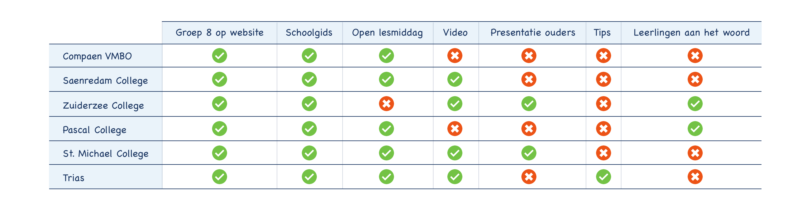

# 3.8 Comparison chart

## Inleiding

Om inzicht te krijgen in de concurrentie van het Zaanlands Lyceum heb ik onderzoek gedaan naar andere middelbare scholen in de Zaanstreek. De scholen die ik heb vergeleken zijn: Compaen VMBO, Saenredam College, Zuiderzee College, Pascal College, St. Michael College en Trias. Ik heb gekeken welke tools de schools aanbieden en wat er mist. De resultaten van het onderzoek zijn verwerkt in een Comparison Chart. Door te kijken naar wat gemiste kansen zijn van anderen, wordt het duidelijker waar een perfect eindproduct aan moet voldoen.

## Belangrijkste resultaten:

* Elke school maakt gebruik van een apart kopje over 'Groep 8' op de website
* Elke school heeft een schoolgids
* Alleen het Zuiderzee College heeft geen Open lesmiddag
* Het Pascal College en Compaen hebben als enige geen video op de website
* Alleen Trias geeft tips aan de nieuwe leerlingen
* Het Zuiderzee College en st. Michael College hebben een presentatie met informatie voor ouders op de website

