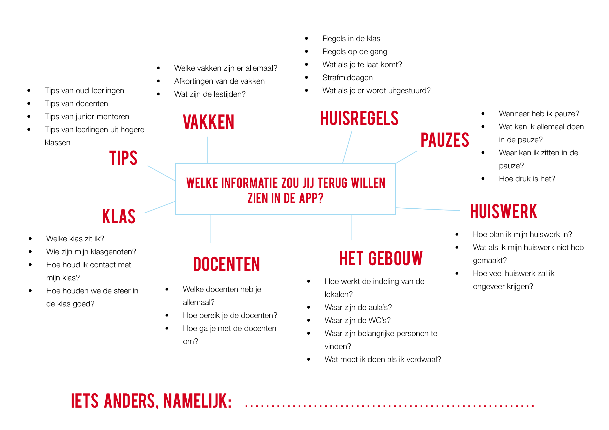
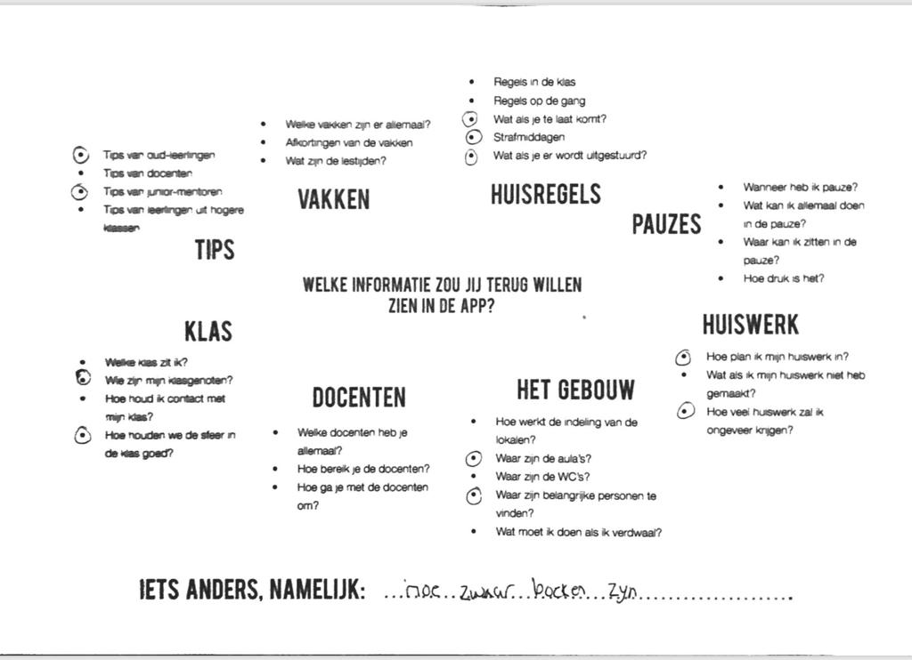
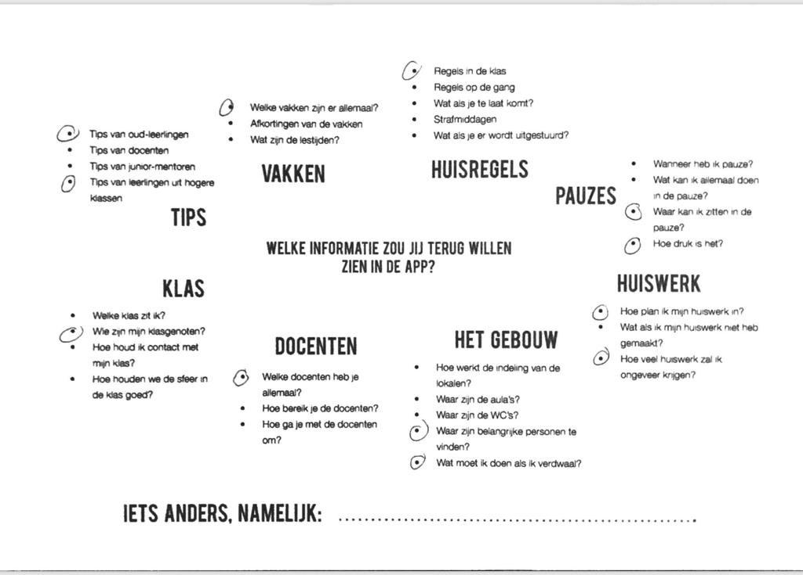
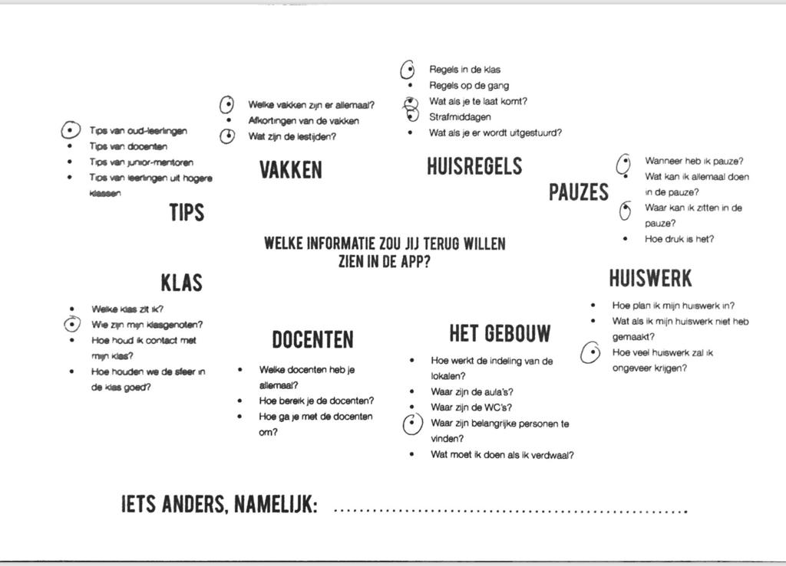

# 3.11 Invulling content

## Inleiding

Voor de invulling van de content van de app is het belangrijk om te weten welke informatie de leerlingen exact liever van te voren hadden willen weten, zoals eerder door hen werd aangegeven in [de Enquête. ](../3.-onderzoek/3.1-enquete-18-september-2018.md)Om hier achter te komen heb ik zelf van te voren een woordweb opgesteld met potentiële informatie. Daarnaast heb ik ruimte opengelaten waar de leerlingen zelf informatie kunnen opschrijven. Vervolgens heb ik het werkblad op 20 december aan een groepje leerlingen gegeven en heb hen laten aankruisen/opschrijven welke informatie zij graag van te voren hadden willen weten. Het doel hiervan was om te achterhalen welke informatie voor hen als belangrijk wordt gezien, zodat hier bij het invullen van de content in de toekomst rekening mee kan worden gehouden. 

## Werkblad

## Uitwerking:



## Leerling 1




## Leerling 2




## Leerling 3




## Leerling 4




## Leerling 5




## Ingevulde informatie

De informatie die de leerlingen terug zouden willen zien in de app:

* Tips van oud-leerlingen
* Tips van junior-mentoren
* Wie zijn mijn klasgenoten?
* Welke docenten heb ik allemaal?
* Welke vakken zijn er allemaal?
* Wat als je te laat komt?
* Wat zijn de lestijden?
* Regels in de klas
* Wat als je te laat komt?
* Hoe werkt een strafmiddag?
* Wat als je eruit wordt gestuurd?
* Hoe plan ik mijn huiswerk?
* Hoeveel huiswerk zal ik krijgen?
* Waar zijn de aula's?
* Wat kan ik allemaal doen in de pauze?
* Hoe druk zijn de pauzes?
* Waar zijn de belangrijke personen te vinden?
* Hoe werkt de indeling van de lokalen?

