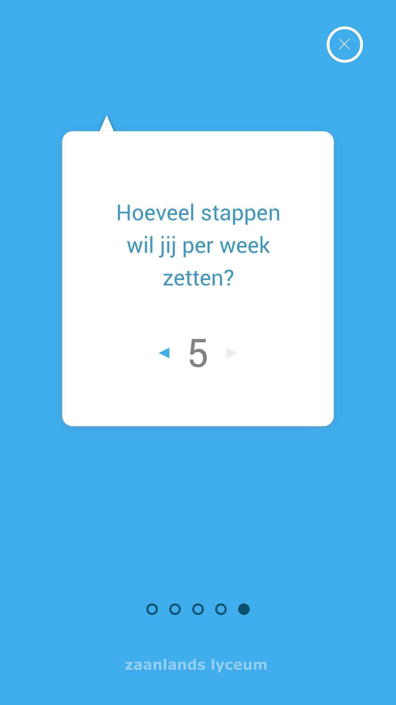
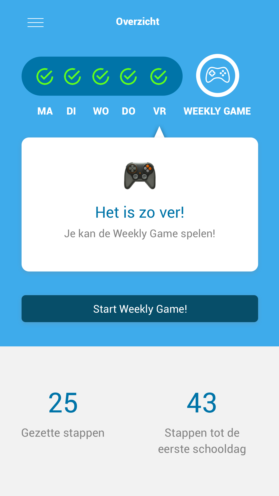
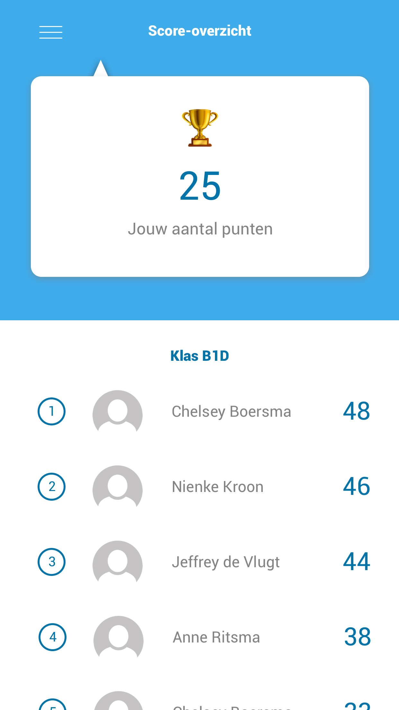
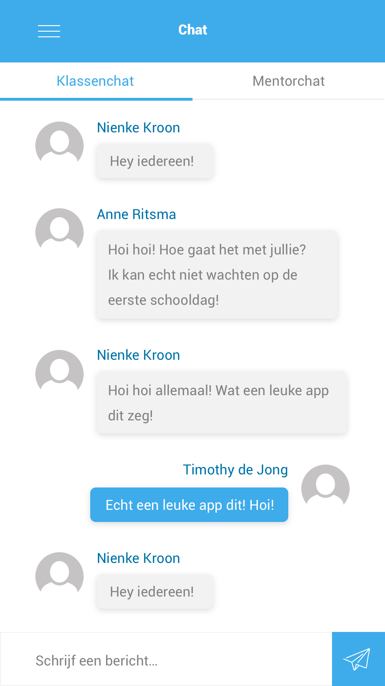

# 3.10 Tweede versie concept

Op basis van de feedback die ik op de [Feedback Frenzy ](5.2-feedback-frenzy.md)heb ontvangen, én de [co-creation workshop met leerlingen](3.9-brainstormsessie-met-leerlingen.md) heb ik een aantal dingen aan [het concept 'Jouw Grote Stap'](5.1-eerste-versie-concept.md) veranderd. Op deze pagina zal ik toelichting geven op de aanpassingen die ik binnen mijn concept heb doorgevoerd.

### Aanpassingen concept:

* Bij de eerste aanmelding kunnen de leerlingen aangeven hoe vaak per week zij een stapje willen zetten, dit is minimaal 1 keer en maximaal 5 keer \(zie afbeelding\). Zo bepaalt elke leerling zelf hoe lang hij of zij erover doet om de 'Grote Stap' te zetten. Er werd in de co-creation workshop namelijk aangegeven dat leerlingen het prettig zouden vinden als zij zelf het aantal stappen per week zouden kunnen bepalen.

* De stappen die leerlingen kunnen zetten is vervolgens op dag zelf vanaf 00:00 beschikbaar. Alle stappen blijven ook nadat zij gezet zijn beschikbaar voor de gebruiker. Zo kunnen de leerlingen altijd nog iets opzoeken mochten zij het zijn vergeten.
* De 'Weekly Game' zal elke vrijdag in de vorm van een quiz beschikbaar zijn. Voor de leerling die de afgelopen week meer stappen gezet heeft, zal de quiz uitgebreider zijn dan de ander.

* Leerlingen kunnen een score-overzicht zien van alle leerlingen uit hun \(toekomstige\) klas. Hoe meer stappen de leerling zet, hoe meer punten er verdiend kunnen worden.

* Er zal ook een chat-functie in de app komen. Er is een klassenchat met alle leerlingen uit de toekomstige klas waarin iedereen alvast kennis met elkaar kan maken. Daarnaast kunnen de leerlingen ook hun junior-mentor een vraag stellen via een aparte chat. Tijdens de[ co-creation sessie ](3.9-brainstormsessie-met-leerlingen.md)gaven de leerlingen aan dat zij hun vragen eerder aan de junior-mentor durven te stellen dan aan de echte mentor. Er zal echter wel een maximum worden ingesteld voor het aantal berichten dat er gestuurd kan worden naar de junior-mentor. Dit is om overlast te voorkomen.

* De achterkant van de app, zoals deze eerder is besproken in de [eerste versie van het concept](5.1-eerste-versie-concept.md) zal niet worden doorgevoerd. Mijn docent gaf mij als feedback dat dit voor de leerlingen wellicht te erg het gevoel zal geven dat zij continu worden gecontroleerd, dit wil ik voorkomen.  

