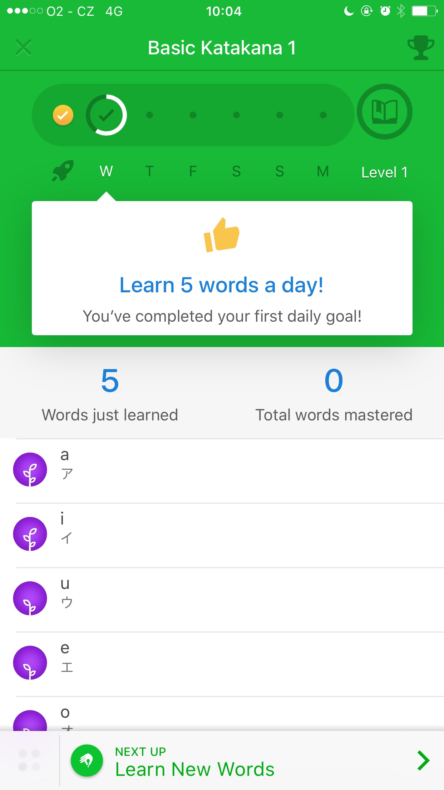

# 3.6.1 Patterns

Voor mijn eindproduct ben ik op zoek gegaan naar design patterns die ik wellicht in mijn eindproduct zou kunnen verwerken. Ik geef bij elk gekozen pattern aan om welke redenen ik het pattern als bruikbaar zie. 

### Pattern 1: Progress bar - Memrise App

De app Memrise maakt naar mijn mening op overzichtelijke wijze zichtbaar hoe ver de gebruiker in het proces is. Er is te zien hoe veel stappen het proces bevat en welke stappen al gezet zijn. Het vinkje verduidelijkt wederom de gezette stap.

#### 

### Pattern 2: Log in - Keybase App

De manier waarop de app Keybase een inlogscherm weergeeft vind ik erg duidelijk. Er is niet te veel afleiding voor de gebruiker en het is duidelijk wat er van de gebruiker verwacht wordt.

### Pattern 3: Score overview - Memrise App

De app Memrise gebruikt een overzichtelijke manier om een score-overzicht weer te geven. Je ziet de afbeelding van de speler, de ranking, naam en het puntenaantal. Dit is een zeer bruikbaar pattern voor het score-overzicht van mijn eindproduct.   

### **Pattern 4: Navigatie - Gmail**

De manier waarop Gmail het hamburger-menu gebruikt vind ik erg duidelijk. Vooral omdat in het opengeklapte menu de gegevens van de gebruiker - inclusief foto - ook weergegeven zijn.   

### **Pattern 5: Chatfunctie - Facebook Messenger** 

De chatfunctie van Facebook Messenger is één van de meestgebruikte chat-apps en ik vind het ontwerp hiervan ook zeker een reden toe. Erg overzichtelijk en ik denk dat dit deels ook komt doordat er veel gebruik wordt gemaakt van de kleur wit. 

### Pattern 6: Walkthrough - Truebill App

Hoe de Truebill App gebruik maakt van een Walktrough vind ik erg nuttig. De gebruiker krijgt in een aantal punten uitleg over de app, zo schrik je de gebruiker niet af met een lange lap tekst. 

