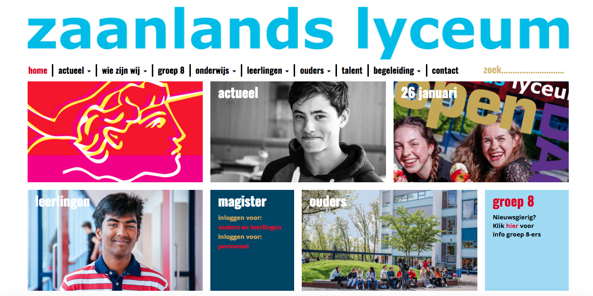
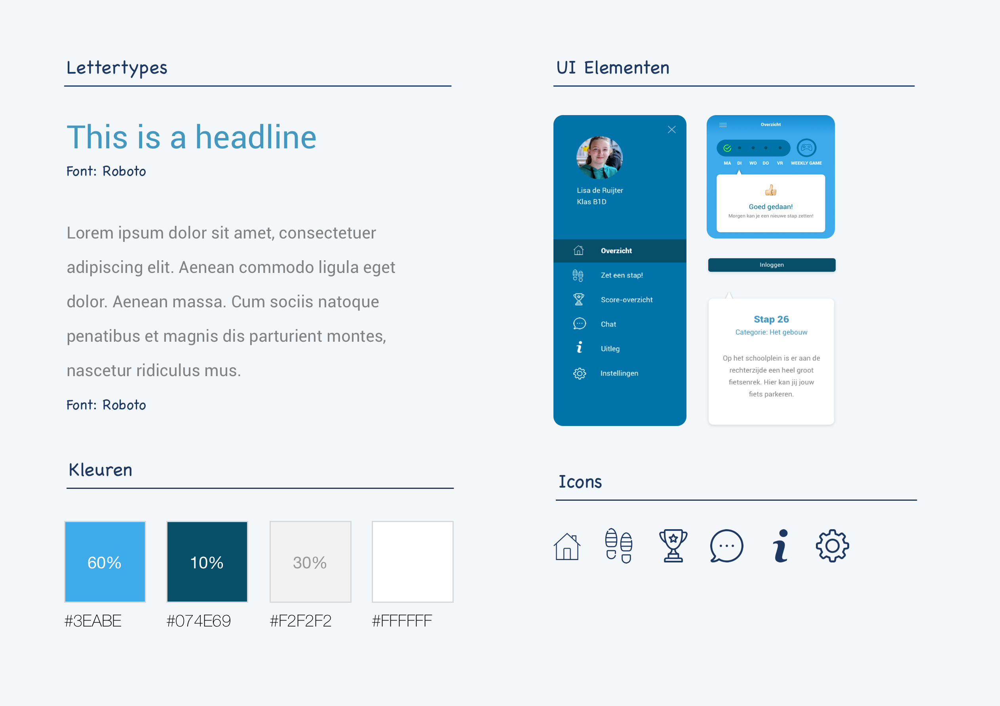

# 3.6 Visueel onderzoek

### Huisstijl Zaanlands Lyceum

De vormgeving van mijn eindproduct moet qua vormgeving aansluiten op de huidige huisstijl van het Zaanlands Lyceum. De website van het Zaanlands Lyceum ziet er als volgt uit:

### Kleuren

De basiskleur van het Zaanlands Lyceum is lichtblauw. De accentkleuren die daarbij gebruikt worden zijn donkerblauw, rood en goud. In mijn eindproduct zal ik vooral de kleur blauw benadrukken, dit omdat blauw de hoofdkleur is van de school. Ook in het interieur en het gebouw zelf is de kleur blauw erg aanwezig. Ik hoop dat de gebruiker zo gelijk een link zal leggen tussen het eindproduct en het Zaanlands Lyceum zelf. 

Beeldbalie.nl \(2018\) schrijft het volgende over de kleur blauw: "Het is een kleur die staat voor de geest, intelligentie en verstand. Blauw wordt gezien als de kleur van vertrouwen, duidelijke communicatie en betrouwbaarheid." Voor leerlingen die op het punt staan om een grote, spannende stap zetten denk ik dat dit belangrijke eigenschappen zijn. Vooral intelligentie, duidelijke communicatie en betrouwbaarheid zijn belangrijke kernwaarden.  

### Font

Het gekozen lettertype is Roboto. Roboto is een modern, maar toegankelijk font. Er is bewust gekozen voor een font wat niet te kinderlijk aanvoelt, zodat de leerlingen het gevoel hebben dat zij serieus genomen worden. Het font moet rust creëren in tegenstelling tot het kleurgebruik en de aanwezige Emoji’s.    

### Tone of voice

Om de leerlingen te motiveren om zo veel mogelijk stappen te zetten, wordt er gebruik gemaakt van een 'activerende' tone of voice. Termen als 'Goed gedaan!' en 'Helaas, volgende keer beter!' zullen worden toegepast. Daarnaast blijft positiviteit continu de boventoon voeren. Mocht een leerling een antwoord fout hebben, zal deze positieve en motiverende feedback krijgen. De zinsopbouw in de app zal kort en bondig zijn. De doelgroep gaf eerder in de [co-creation sessie](../3.9-brainstormsessie-met-leerlingen.md) al aan dit prettig te vinden. 

### Styletile

Om een beeld te geven van de kleuren en fonts die ik bij mijn eindproduct zal gebruiken heb ik een Styletile opgesteld. 

### \*\*\*\*

### **60–30–10 Regel**

In een artikel van Wojciech Zieliński \(2017\) genaamd 'How to use colors in UI Design' schrijft hij over kleurgebruik binnen UI Design. In dit artikel kaart hij een interessante regel aan. De zogeheten '60-30-10 Regel', hij schrijft erover het volgende: "The 60% + 30% + 10% proportion is meant to give balance to the colors. 60% is your dominant hue, 30% is secondary color and 10% is for accent color." Het gaat er dus om dat 60% van je ontwerp uit de hoofdkleur bestaat, 30% uit de steunkleur en 10% uit de accentkleur. Deze formule zorgt voor een vorm van balans in het ontwerp en hier zal ik mijn eindproduct ook op afstemmen \(zie Styletile\).   
****

### **Emoji's**

Uit [de brainstormsessie met leerlingen ](../3.9-brainstormsessie-met-leerlingen.md)kwam naar voren dat de leerlingen het leuk zouden vinden als er Emoji's gebruikt zouden worden. Emoji's zijn een soort kleine plaatjes/emoticons die je kunt gebruiken, om je \(digitale\) tekst te verduidelijken. 

In het artikel 'De invloed van emoji  op onze taal  en communicatie ' \(van Staalduinen, 2018\) op FrankWatching.com wordt het volgende over Emoji's geschreven: "Emoji's worden net als emoticons gebruikt om misverstanden in digitale communicatie te voorkomen. Met een emoji kun je iets nuanceren, onderstrepen of ergens op reageren. Ze zijn inmiddels zo ingeburgerd in onze vluchtige communicatievormen dat we er nauwelijks meer bij stilstaan dat we ze gebruiken. In een digitaal gesprek vervang je die non-verbale communicatie door emoji." Het lijkt mij dus leuk om het advies van de leerlingen op te volgen en de Emoji's te gaan verwerken in mijn eindproduct.  

### BJ Fogg's Behavior Model

Om ervoor te zorgen dat mijn eindoplossing daadwerkelijk voor een verandering van gedrag zorgt, ga ik gebruik maken van Fogg's Behavior Model \(zie afbeelding\). "Dit model is gebaseerd op 3 elementen: motivatie \(willen\), in staat zijn om te veranderen \(kunnen\), en triggers. Als gedragsverandering niet optreedt, ontbreekt ten minste een van deze elementen. Wanneer je de missende bouwsteen ontdekt, weet je waar je aan kunt werken. BJ Fogg is onderzoeker op het gebied van gedragsbeïnvloeding aan de Stanford University in de Verenigde Staten." aldus een artikel over het gedragsmodel op Crow.nl \(Metz, 2013\). 

Het is dus belangrijk dat ik bij mijn eindproduct ervoor zorg dat ik de leerlingen genoeg motiveer, dat zij in staat zijn om het eindproduct te gebruiken en dat zij worden getriggerd. Zodra één van deze onderdelen ontbreekt, zal het lastig zijn om het gedrag van de leerlingen de beinvloeden.   

### Belangrijkste eisen:

* Het ontwerp van de oplossing moet rekening houden met de 60-30-10 regel. **\(Must have\)**
* Het ontwerp van de oplossing moet aansluiten op de gemaakte Styletile. **\(Must have\)**
* De oplossing moet aansluiten op het Fogg's Behavioral Model. **\(Must have\)**

