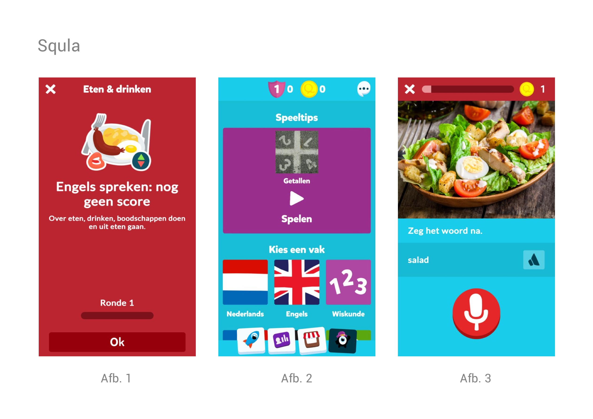
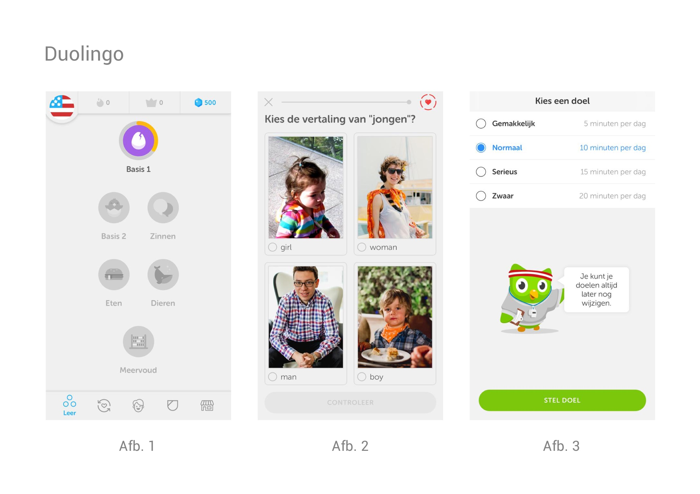
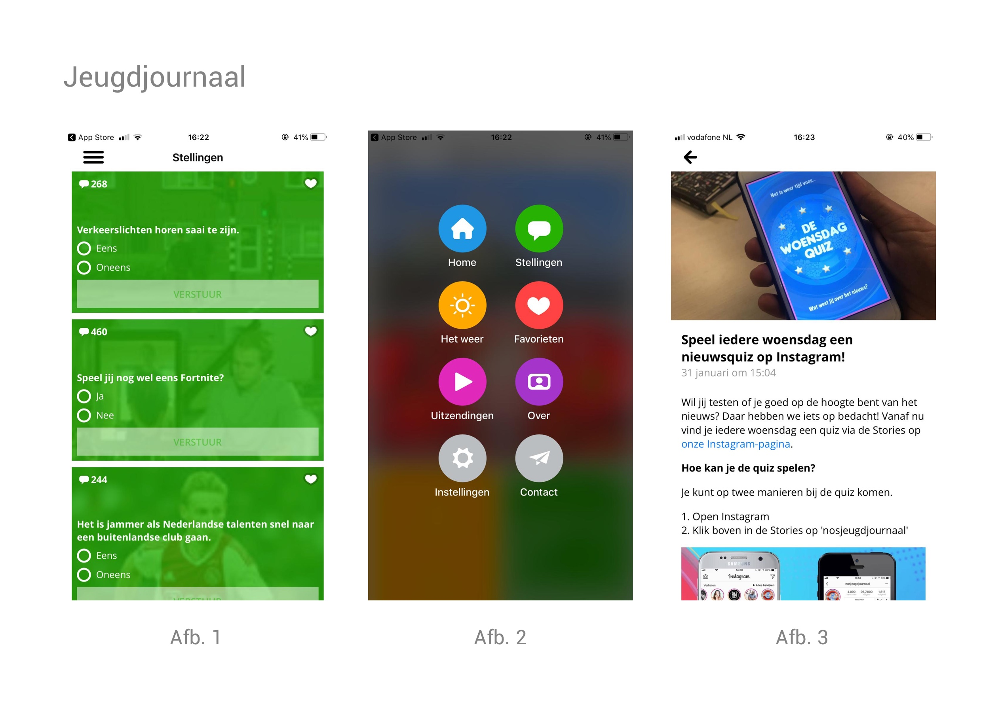
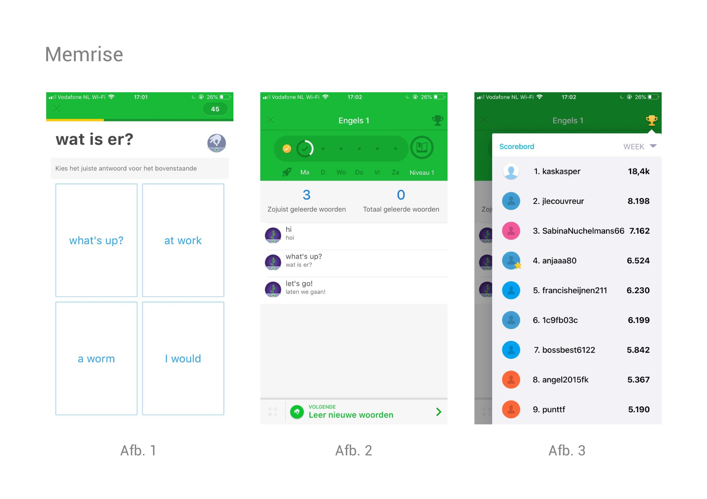

# 3.7 Best, good & bad practices

Om een beter inzicht te krijgen in wat andere soorten onderwijsapps doen qua vormgeving en interactie, ga ik de tool 'Best, good & bad practices' toepassen. Hierbij ga je verschillende soortgelijke applicaties met elkaar vergelijken en probeer je er voor jezelf het beste uit te halen. Ik ga de volgende apps analyseren: Squla, Duolingo, Jeugdjournaal en Memrise. Onderaan de pagina zijn de belangrijkste eisen weergegeven die worden meegenomen in het [Programma van Eisen. ](3.4-programma-van-eisen-1.0.md)

### 1. Squla - Onderwijsapp

| **Good** | **Bad** |
| :--- | :--- |
| Leuk gebruik gemaakt van illustraties \(zie afb. 1\) | Te veel content op het dashboard \(zie afb. 2\) |
| Duidelijke voortgang zichtbaar \(zie afb. 3\) | Onduidelijk wat er van de gebruiker verwacht wordt \(zie afb. 2\) |
| Vormgeving \(voornamelijk het kleurgebruik\) past goed bij de doelgroep |  |

###  

### 2. Duolingo - App om verschillende talen te leren

| Good | Bad |
| :--- | :--- |
| Gehele app in grijstinten, actieve knoppen of functies zijn met kleur aangegeven, oogt erg overzichtelijk | Vormgeving kan saai overkomen op de doelgroep |
| Leuke mascotte die je door de app heen leidt | Geen "echt" menu |
| Dashboard erg overzichtelijk, aantal behaalde punten goed te zien \(zie afb. 1\) |  |
| Voortgang duidelijk weergegeven \(zie afb. 1\) |  |

###   

### 3. Jeugdjournaal - Nieuwsapp voor jongeren

| Good | Bad |
| :--- | :--- |
| Creatief menu \(zie afb.2\) | Menu is niet continu beschikbaar \(zie afb. 3\) |
| Gebruik van icons in menu is duidelijk \(zie afb.2\) | Vrij saaie manier van content weergeven \(afb. 3\) |

### 4. Memrise - App om verschillende talen te leren

| Good | Bad |
| :--- | :--- |
| Voortgang duidelijk te zien \(zie afb. 2\) | Weinig gebruik van icons of afbeeldingen |
| Indeling quiz overzichtelijk \(afb. 1\) | Veel ongebruikte ruimte bij dashboard \(zie afb.2\) |
| Scoreboard creatief weergegeven \(zie afb. 3\) |  |

### 

### Belangrijkste eisen:

* De voortgang van de gebruiker moet duidelijk zichtbaar zijn op de Homepage **\(Must have\)**
* Het menu moet gebruik maken van icons **\(Could have\)**

\*\*\*\*

