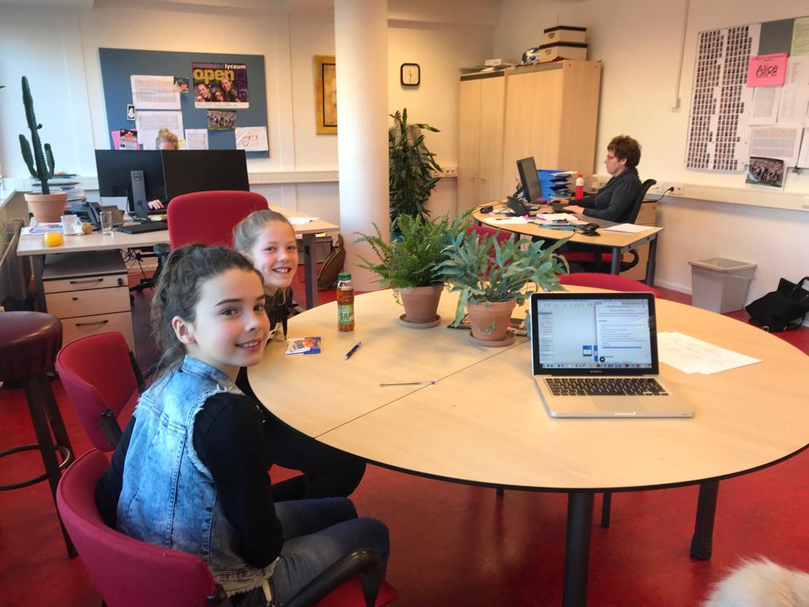

# 5.1.1 Test + Resultaten

## Inleiding

Om te valideren of alle fouten en moeilijkheden uit het prototype zijn gehaald, heb ik 9 januari nog een laatste keer mijn prototype getest op een groepje leerlingen. Mevrouw Landheer had geregeld dat er ik mijn prototype op drie leerlingen kon testen en na de test heb ik nog een gesprekje met hun gehad. Helaas moest één van de leerlingen na de test gelijk weg en heb ik hem achteraf nog niet kunnen spreken. Mijn doel was om de te kijken of de opgestelde Job stories nu probleemloos uit te voeren zijn. 

## Voorbereiding 

Als voorbereiding op de test heb ik het prototype wederom weer 'werkend' gemaakt in de app Principle. Ik zal de test uitvoeren op mobiel zodat dit gelijk staat aan de 'echte' gebruikerservaring.

Verder zal ik gebruik maken van dezelfde Job Stories als bij de test van [Prototype 0.9](../../6.-prototype/4.2-prototype-0.9/4.2.1-test-+-resultaten.md). Zo kan ik namelijk controleren of de taken na de iteratie beter uit te voeren zijn. Ik vroeg de testpersonen daarnaast tijdens te test om hardop te denken zodat ik een beter inzicht kreeg in wat zij op dat moment dachten. Ik heb van de test een geluidsopname gemaakt en de belangrijkste testresultaten per testpersoon per Job story zijn terug te vinden op deze pagina. 

### Job Stories  

1. Open de app, probeer in te loggen en de uitleg over de app te lezen. Snap je alles?
2. Begrijp je hoe je het menu moet openen?
3. Ga naar de klassenchat.
4. Probeer een gesprek te starten met jouw mentor.
5. Bekijk het score-overzicht van de gehele klas.
6. Probeer de uitleg over de app nog een keer te bekijken.
7. Het is vrijdag, je kan de Weekly Game spelen. Open de Weekly Game en speel hem.
8. Zet een stap. 
9. Verlaag het aantal stappen dat jij in een week wil zetten naar 3.

## Testresultaten



### Testpersoon 1

1. **Open de app, probeer in te loggen en de uitleg over de app te lezen. Snap je alles?** _Gaat probleemloos. Toen ik vroeg wat ze van de vooraf ingestelde afbeeldingen vond, gaf ze aan dat ze dit heel leuk vond. Alleen kende ze twee van de personages niet.  ****_
2. **Begrijp je hoe je het menu moet openen?**  
   _Probleemloos en snel uitgevoerd._ 

   \_\_

3. **Ga naar de klassenchat.** _Niks op aan te merken. ****_
4. **Probeer een gesprek te starten met jouw mentor.** _Gaat ook goed. ****_
5. **Bekijk het score-overzicht van de gehele klas.** _Gaat goed. Ik vroeg haar of het duidelijk was op welke plaats in het score-overzicht zij staat, zij gaf aan dat dit duidelijk was doordat haar eigen score in het blauw was weergegeven._  ****
6. **Probeer de uitleg over de app nog een keer te bekijken.**  
   _Via het menu weet ze snel naar de uitleg te gaan._ 

   \_\_

7. **Het is vrijdag, je kan de Weekly Game spelen. Open de Weekly Game en speel hem.** _Ze klikt snel door de Weekly Game heen. Ik merk dat de 'Volgende vraag' knop goed gebruikt wordt en er valt niks op of aan te merken op de uitvoering van de Job story. Ik vroeg haar of zij misschien nog iets aan te merken had, dit was niet het geval._  ****
8. **Zet een stap.**  _Gaat probleemloos._ 
9. **Verlaag het aantal stappen dat jij in een week wil zetten naar 3.** _Ze volbrengt de jobstory probleemloos._ ****



### **Testpersoon 2**

1. **Open de app, probeer in te loggen en de uitleg over de app te lezen. Snap je alles?** _Gaat goed. Hij leest de uitleg netjes en op zijn gemak._  ****
2. **Begrijp je hoe je het menu moet openen?**  
   _Gaat goed. Ik vroeg hem hoe hij dit menu wist te openen, hij gaf aan dat hij het menu-teken herkent._ 

   \_\_

3. **Ga naar de klassenchat.** _Niks op aan te merken, navigeert netjes via het menu._ 
4. **Probeer een gesprek te starten met jouw mentor.** _Gaat goed._ **** _****_
5. **Bekijk het score-overzicht van de gehele klas.** _Ook dit gaat zonder problemen, hij scrollt ook naar beneden om de rest van de scores te bekijken._   ****
6. **Probeer de uitleg over de app nog een keer te bekijken.**  
   _Gaat probleemloos. Hij lees de informatie nog een keer en sluit het vervolgens netjes af met het kruisje._ 

   \_\_

7. **Het is vrijdag, je kan de Weekly Game spelen. Open de Weekly Game en speel hem.** _Doet hij snel en probleemloos, hij leest de feedback netjes en lacht zelf een beetje bij sommige vragen._  
8. **Zet een stap.**  _Hij weet via het menu netjes te navigeren en een stap te zetten_  
9. **Verlaag het aantal stappen dat jij in een week wil zetten naar 3.** _Gaat heel goed._ 



### **Testpersoon 3**

1. **Open de app, probeer in te loggen en de uitleg over de app te lezen. Snap je alles?** _Doet ze probleemloos en upload netjes een foto._  
2. **Begrijp je hoe je het menu moet openen?** _Probleemloos, ze klikt hem open en als ik haar vraag of ze hem ook dicht kan doen, lukt dat haar ook._ ****
3. **Ga naar de klassenchat.** _Gaat goed. Ze leest aandachtig het nepgesprek in de chat door ;-\)._  
4. **Probeer een gesprek te starten met jouw mentor.** _Niks op aan te merken.  ****_
5. **Bekijk het score-overzicht van de gehele klas.** _Probleemloos. Ik vraag haar ook of ze kan zien op welke plek in de ranglijst ze staat, ze scrollt naar beneden en wijst het correct aan._  ****
6. **Probeer de uitleg over de app nog een keer te bekijken.**  
   _Doet ze zonder enige problemen._

   \_\_

7. **Het is vrijdag, je kan de Weekly Game spelen. Open de Weekly Game en speel hem.** _Gaat goed. Niks op aan te merken._  
8. **Zet een stap.**  _Lukt haar ook probleemloos._  
9. **Verlaag het aantal stappen dat jij in een week wil zetten naar 3.** _Niks op aan te merken. Als ik vraag om feedback zegt ze dat ze eigenlijk alles goed en duidelijk vond._ 



## Conclusie

De laatste test was super positief. De leerlingen vonden de app erg verbeterd en zij hebben elke job story probleemloos kunnen uitvoeren. De enige feedback die ik na de test kreeg ging over de invulling van de content, zij kwamen met ideetjes voor informatie die ik zou kunnen gebruiken voor de invulling van de stappen. Voorbeelden hiervan waren 'Hoe werkt een strafmiddag precies?' en 'Hoe zwaar zijn de boeken?'

Eén van de leerlingen gaf zelfs aan dat ze baalt dat zij nu al in de Eerste klas zit. Ze had de app graag willen gebruiken. Ze heeft haar broertje - die momenteel in groep 7 zit - al zelfs verteld over de app. "Hij MOET de app echt gebruiken, want het is echt super handig" zei ze. 

Ik vind dit een erg positieve afsluiting van het project. Ik kan met zekerheid zeggen dat mijn doelgroep enthousiast reageert op het eindproduct, en dat maakt mij toch wel een beetje trots. Hoe leuk is het dat één van de leerlingen uit het testgroepje al thuis haar broertje uit groep 7 heeft verteld over de app? Ik kan niks anders zeggen dan dat ik super blij ben met het resultaat van de laatste test. 

