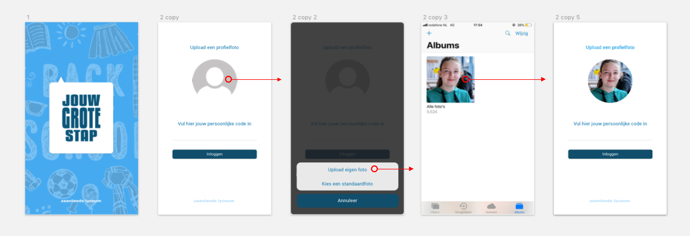
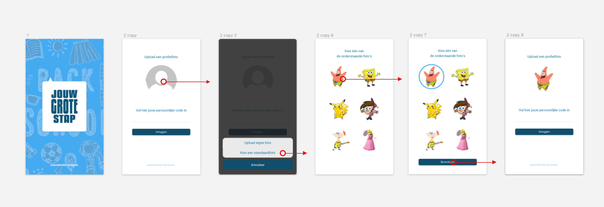
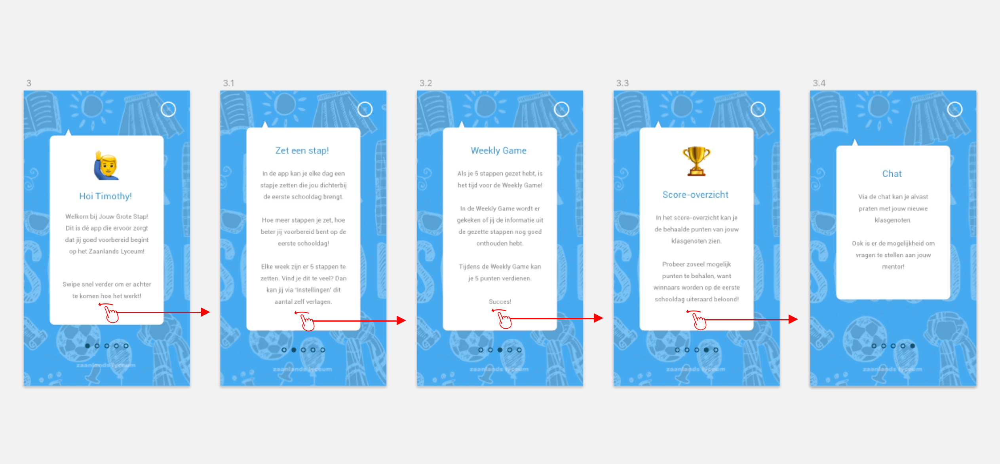
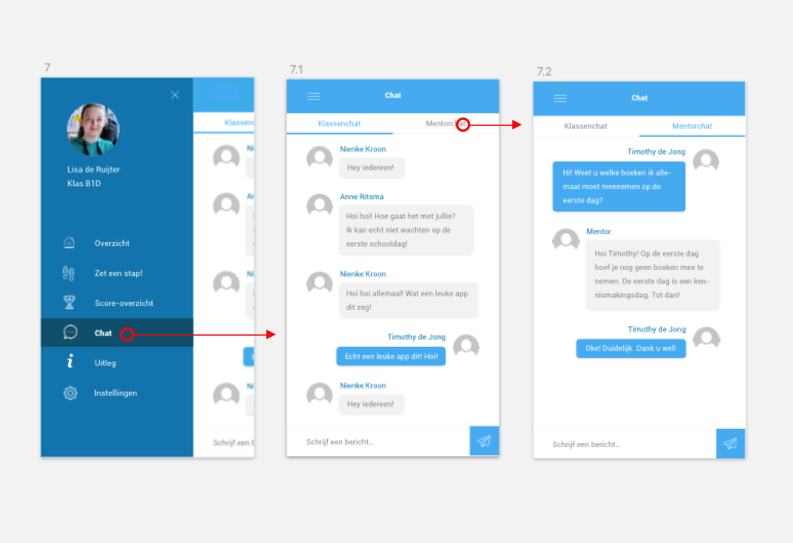
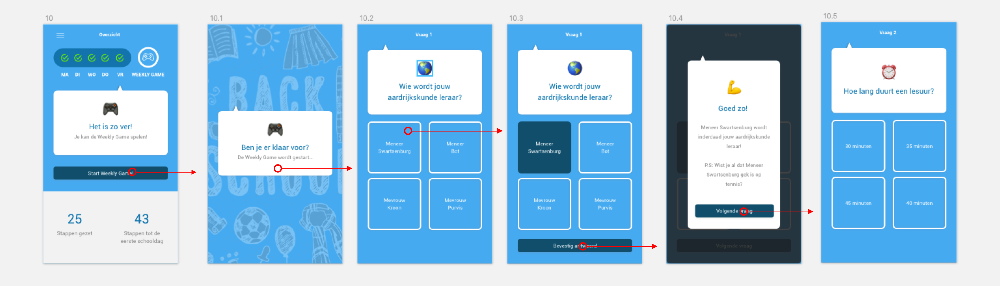
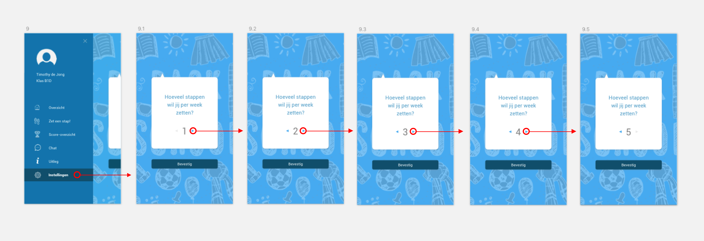
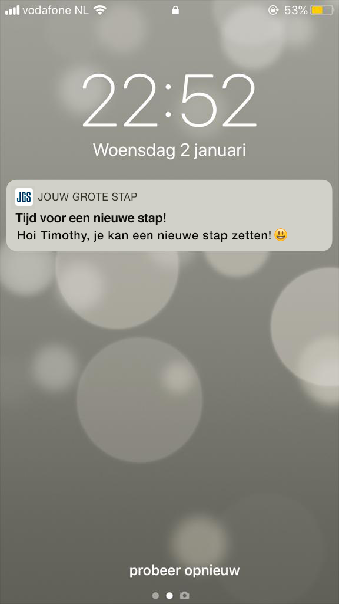

# 5.1 Prototype 1.0

Met behulp van de testresultaten van [Prototype 0.9](../../6.-prototype/4.2-prototype-0.9/) heb ik nog een keer kunnen itereren en ben ik tot de volgende én mijn uiteindelijke versie \(voor dit project\) Prototype 1.0 gekomen. Ik zal de belangrijkste aanpassingen t.o.v Prototype 0.9 op deze pagina duidelijk toelichten. 

### 1.0 Inloggen

> Qua vormgeving heb ik ervoor gekozen om meer 'schoolse' illustraties toe te voegen. Ik heb lichte krijttekeningen aan de achtergrond toegevoegd. Uit de gesprekken met de doelgroep en de testpersonen merkte ik dat de leerlingen veel van kleur en vrolijkheid houden. Om de gebruiker niet te veel af te leiden leken de krijttekeningen op de achtergrond mij een leuk idee.

Als toevoeging op het inlogproces kunnen de leerlingen nu naast het kiezen van een eigen foto, ook kiezen uit een aantal voorgeselecteerde standaardfoto's. Als voorbeeld zijn dit nu een aantal stripfiguren, maar dit kan natuurlijk aangepast worden.  Zo kunnen leerlingen die geen eigen foto willen uploaden tóch nog een foto aan hun foto toevoegen. 

### 2.0 Uitleg app

> Ook hier heb ik de krijttekeningen toegevoegd. Verder wordt er nu uitgelegd dat de leerlingen via het kopje 'Instellingen' zelf kunnen aanpassen hoeveel stappen zij per week kunnen zetten. De uitleg van de app is nu ook later terug te kijken via het kopje 'Uitleg' in het menu.

Uit de testresultaten is gebleken dat deze jobstory geen problemen met zich meebracht. Er zijn verder geen wijzigingen gemaakt. 

### 3.0 Navigatie

> Als het menu nu wordt geopend komt er een kruisje in beeld om het menu ook weer te sluiten. Ook zijn er in het menu icons toegevoegd ter verduidelijking. Daarnaast zijn de menu-items 'Uitleg' en 'Instellingen' toegevoegd.

Het kruisje blijft nog steeds in het menu staan, maar als er een menu-item wordt aangeklikt schuift het menu automatisch dicht. Uit de test bleek namelijk dat verschillende testpersonen wachtten op het moment dat het menu vanzelf dicht zou schuiven. 

### 4.0 Score-overzicht

> Wederom hier de lichte krijttekening toegevoegd. Verder waren er geen grote aanpassingen nodig.

Het score-overzicht is na de laatste iteratie onveranderd gebleven. 

### 5.0 Chat

> In de chat heeft de gebruiker de mogelijkheid om te chatten met de nieuwe klasgenoten. Daarnaast is er ook een aparte chat-mogelijkheid met de junior-mentor. Zo heeft de gebruiker de mogelijkheid om vragen te stellen aan de junior-mentor. Echter zit er wel een maximum op het aantal berichten dat er per dag gestuurd kan worden naar de junior-mentor. Ook zit de junior-mentor als toezichthouder in de klassenchat, zodat hij of zij kan ingrijpen bij mogelijke incidenten of pestgedrag.

De chat is na de laatste iteratie onveranderd gebleven. 

### 6.0 Zet een stap

> Ter verduidelijking tekst toegevoegd bij de stap die nog niet beschikbaar is.

Verder zijn de stappen na de laatste iteratie onveranderd gebleven. 

### 7.0 Weekly Game

> Ook hier zijn de krijttekeningen toegevoegd. Daarnaast is er een knop met 'Volgende vraag' toegevoegd aan de uitleg van de vraag.

Uit de testresultaten bleek dat de 'Volgende vraag' knop goed gebruikt wordt. Het viel op dat de gebruikers gelijk een stuk vlotter door de vragen gingen. Verder is er niets veranderd aan de Weekly Game. 

### 8.0 Instellingen

> Menu-item toegevoegd met 'Instellingen'. Hier kan de gebruiker zelf aanpassen hoeveel stappen hij of zij in een week wil zetten.

In de test merkte ik dat dit goed werkte, de gebruikers konden de instellingen direct beter vinden. Verder zijn de instellingen onveranderd gebleven. 

### 9.0 Push-melding

De gebruiker zal elke dag een push-melding krijgen wanneer hij of zij een nieuwe stap kan zetten. Ook in de push-melding zal de gebruiker persoonlijk aangesproken worden. 

### 

### 

