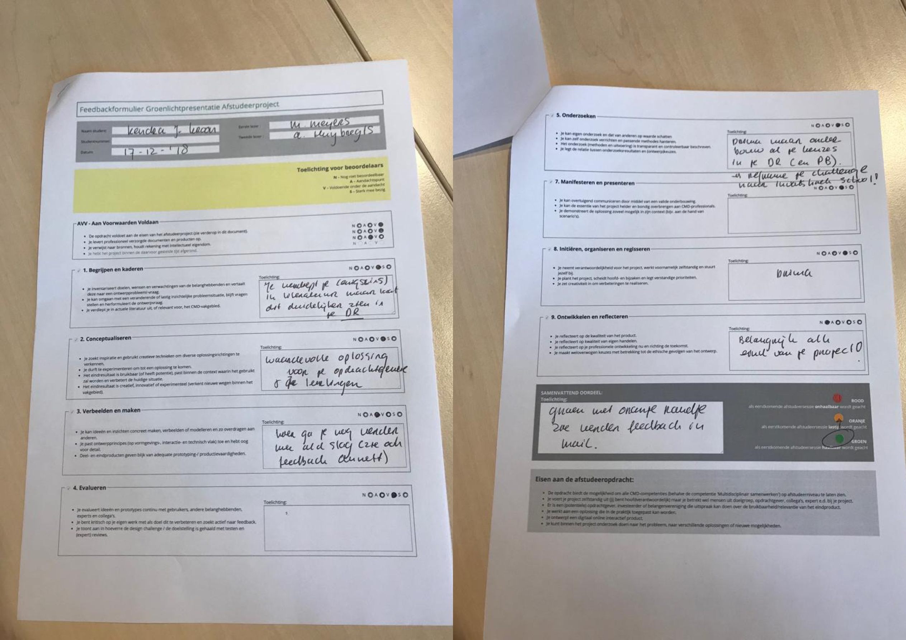
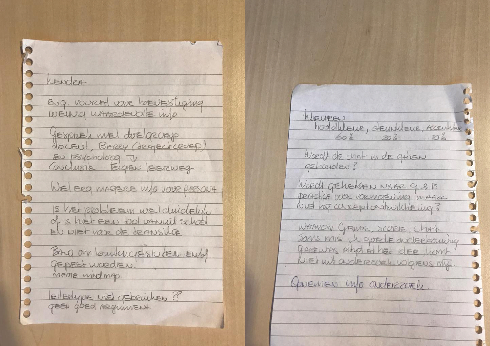

# 4.2 Groenlicht presentatie

> "Bij de groenlicht-presentatie, ongeveer 4 weken voor de eindoplevering, lever je je eindwerk in voor zover dat af is en geef je een presentatie over je werk aan je eerste en tweede lezer. Kies zelf een geschikt medium voor je groenlicht presentatie, bijvoorbeeld powerpoint, keynote, HTML, video, poster of een combinatie van middelen. Maak duidelijke afspraken met je afstudeerbegeleider over wanneer en hoe je je werk inlevert." \(Bron: CMD Moodle, 2018\)

## Voorbereiding 

Als voorbereiding op de Groenlichtpresentatie wilde ik mijn eerste werkende prototype af hebben. Zo kon ik al goed laten zien wat de bedoeling is van mijn oplossing mét werkende interacties. Ik heb daarnaast een presentatie voorbereid waarin ik mijn Design Challenge toelicht en laat zien wat ik allemaal gedaan heb gedurende het project en welke resultaten daaruit zijn voortgekomen. Tot slot laat ik nog mijn plan zien voor de laatste weken. 

## De presentatie



## De feedback

Ik kreeg na afloop van mijn presentatie zeer nuttige feedback. Als advies kreeg ik een groen stoplicht met een oranje randje - omdat Ik heb de presentatie gegeven aan mijn projectbegeleider Marianne Meijer-Meijers en mijn tweede lezer Annett Huijbregts.    
  
Wat vooral naar voren kwam is dat ik nog niet duidelijk genoeg de onderbouwing van bepaalde ontwerpkeuzes heb laten zien in mijn Design Rationale. Ook moet ik een aanpassing maken in mijn Design Challenge. Mijn eindproduct is namelijk meer gefocust op het feit dat alle informatie vanuit het Zaanlands Lyceum bij de leerlingen terecht komt dan op de onzekerheid van de leerlingen. Daarnaast kreeg ik de tip om per stap in mijn onderzoek te laten zien welke requirements hieruit zijn gekomen en moet ik wat aanpassingen maken in mijn huidige persona. Ook werd mij aangeraden om [de informatie mindmap](../3.-onderzoek/3.8-informatie-generatie.md) te laten zien aan de leerlingen en hen te laten aankruisen welke informatie voor hen het belangrijkst is. 

