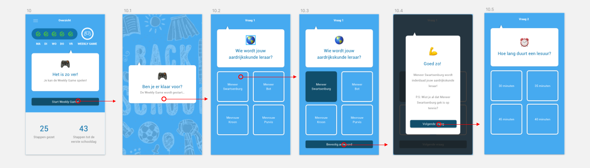
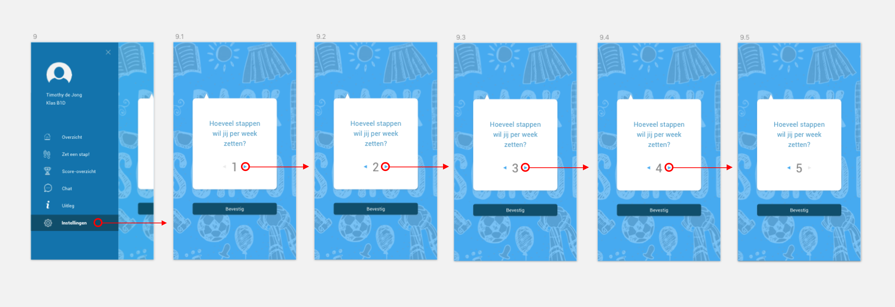
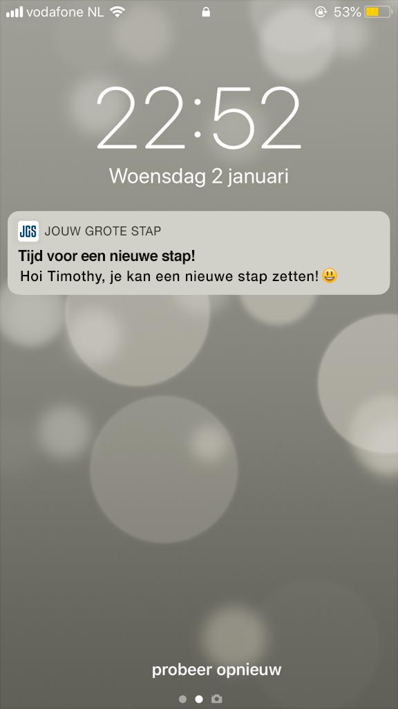

# 4.3 Prototype 0.9

Dankzij de testresultaten van [Prototype 0.5](../prototype-0.5/) heb ik kunnen itereren en ben ik tot de volgende versie van het prototype gekomen. Prototype 0.9 is zo tot stand gekomen. Dit prototype zal ik vervolgens nog een keer testen zodat ik uitkom op mijn uiteindelijke Prototype 1.0.

### 1.0 Inloggen

> Op het inlogscherm moet de leerling zijn of haar persoonlijke inlogcode invullen. Deze code hebben de leerlingen thuis ontvangen in een brief van het Zaanlands Lyceum. Ook krijgt de leerling de optie om een profielfoto te uploaden.

Qua vormgeving heb ik ervoor gekozen om meer 'schoolse' illustraties toe te voegen. Ik heb lichte krijttekeningen aan de achtergrond toegevoegd. Uit de gesprekken met de doelgroep en de testpersonen merkte ik dat de leerlingen veel van kleur en vrolijkheid houden. Om de gebruiker niet te veel af te leiden leken de krijttekeningen op de achtergrond mij een leuk idee.

### 2.0 Uitleg app

> Na het inlogscherm krijgt de gebruiker op persoonlijke wijze uitleg over de app te zien. Met behulp van een _walkthrough_ krijgt de gebruiker de mogelijkheid om door te uitleg heen te swipen. Alle functionaliteiten binnen de app worden kort en bondig uitgelegd. Vervolgens komt de gebruiker terecht op de Homepage.

Ook hier heb ik de krijttekeningen toegevoegd. Verder wordt er nu uitgelegd dat de leerlingen via het kopje 'Instellingen' zelf kunnen aanpassen hoeveel stappen zij per week kunnen zetten. De uitleg van de app is nu ook later terug te kijken via het kopje 'Uitleg' in het menu. 

### 3.0 Navigatie

> De app maakt gebruik van een hamburgermenu. Door op het menu-icon te klikken schuift het menu open, en door nog een keer op het menu-icon te klikken schuift het menu weer dicht.

Als het menu nu wordt geopend komt er een kruisje in beeld om het menu ook weer te sluiten. Ook zijn er in het menu icons toegevoegd ter verduidelijking. Daarnaast zijn de menu-items 'Uitleg' en 'Instellingen' toegevoegd.  

### 4.0 Score-overzicht

> In het score-overzicht ziet de gebruiker zijn of haar eigen score en daarnaast ook de scores van de toekomstige klasgenoten te zien. De scores zijn op basis van het aantal behaalde punten tijdens de Weekly Game.

Wederom hier de lichte krijttekening toegevoegd. Verder waren er geen grote aanpassingen nodig. 

### 5.0 Chat

> In de chat heeft de gebruiker de mogelijkheid om te chatten met de nieuwe klasgenoten. Daarnaast is er ook een aparte chat-mogelijkheid met de junior-mentor. Zo heeft de gebruiker de mogelijkheid om vragen te stellen aan de junior-mentor. Echter zit er wel een maximum op het aantal berichten dat er per dag gestuurd kan worden naar de junior-mentor. Ook zit de junior-mentor als toezichthouder in de klassenchat, zodat hij of zij kan ingrijpen bij mogelijke incidenten of pestgedrag.

Geen grote wijzigingen, op het chat-icon in het menu na.

### 6.0 Zet een stap

> Elke dag kan de gebruiker een nieuwe stap zetten. De gebruiker kan door de verschillende stappen swipen met behulp van een carousel. Bij elke stap is een korte omschrijving weergegeven waarin kort wordt uitgelegd wat er in de stap te leren valt. Echter zijn nog niet alle stappen beschikbaar, de niet-beschikbare stappen worden weergegeven met een slotje erop.

Ter verduidelijking tekst toegevoegd bij de stap die nog niet beschikbaar is.

### 7.0 Weekly Game

> In de Weekly Game krijgt de gebruiker elke week de kans om te laten zien wat hij of zij allemaal geleerd heeft. Door middel van 5 varierende vragen wordt de kennis van de gebruiker getest en kunnen er punten worden verdiend. Voorbeelden van mogelijke vragen zijn: 'Wie wordt jouw Aardrijkskunde leraar?' of 'Op welke verdieping is lokaal Z302 te vinden?'  
> Aan het einde van de Weekly Game wordt het aantal verdiende punten weergegeven en wordt de gebruiker doorverwezen naar het Score-overzicht.

Ook hier zijn de krijttekeningen toegevoegd. Daarnaast is er een knop met 'Volgende vraag' toegevoegd aan de uitleg van de vraag.  

### 8.0 Instellingen

Menu-item toegevoegd met 'Instellingen'. Hier kan de gebruiker zelf aanpassen hoeveel stappen hij of zij in een week wil zetten. 

### 9.0 Push-melding

De gebruiker zal elke dag een push-melding krijgen wanneer hij of zij een nieuwe stap kan zetten. Ook in de push-melding zal de gebruiker persoonlijk aangesproken worden. 

