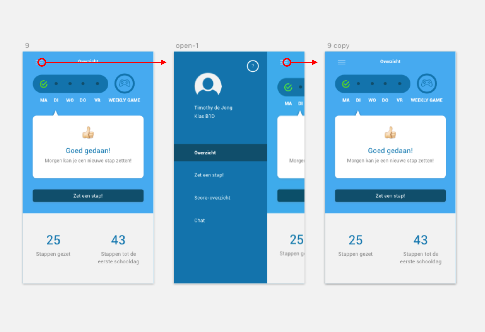
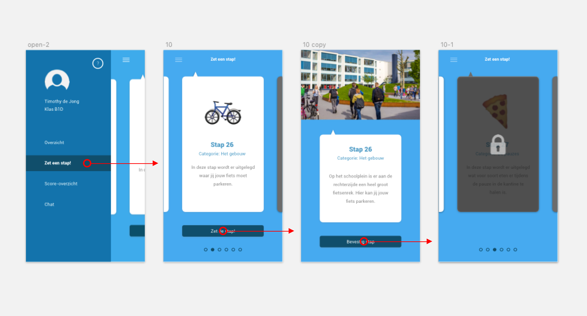
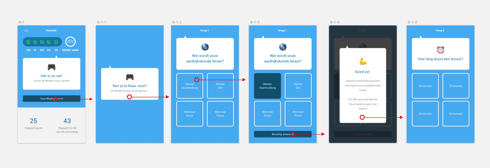

# 4.1 Prototype 0.5

Het eerste prototype van mijn project is Prototype 0.5. Ik zal de verschillende functionaliteiten binnen mijn ontwerp op deze pagina toelichten. Ik heb het eerste prototype wederom getest op mijn doelgroep en de resultaten hiervan zijn hier terug te vinden. 

### 1.0 Inloggen

Op het inlogscherm moet de leerling zijn of haar persoonlijke inlogcode invullen. Deze code hebben de leerlingen thuis ontvangen in een brief van het Zaanlands Lyceum. Ook krijgt de leerling de optie om een profielfoto te uploaden. 

### 2.0 Uitleg app

Na het inlogscherm krijgt de gebruiker op persoonlijke wijze uitleg over de app te zien. Met behulp van een _walkthrough_ krijgt de gebruiker de mogelijkheid om door te uitleg heen te swipen. Alle functionaliteiten binnen de app worden kort en bondig uitgelegd. Vervolgens komt de gebruiker terecht op de Homepage. 

### 3.0 Navigatie

De app maakt gebruik van een hamburgermenu. Door op het menu-icon te klikken schuift het menu open, en door nog een keer op het menu-icon te klikken schuift het menu weer dicht.

### 4.0 Score-overzicht

In het score-overzicht ziet de gebruiker zijn of haar eigen score en daarnaast ook de scores van de toekomstige klasgenoten te zien. De scores zijn op basis van het aantal behaalde punten tijdens de Weekly Game. 

### 5.0 Chat

In de chat heeft de gebruiker de mogelijkheid om te chatten met de nieuwe klasgenoten. Daarnaast is er ook een aparte chat-mogelijkheid met de junior-mentor. Zo heeft de gebruiker de mogelijkheid om vragen te stellen aan de junior-mentor. Echter zit er wel een maximum op het aantal berichten dat er per dag gestuurd kan worden naar de junior-mentor. Ook zit de junior-mentor als toezichthouder in de klassenchat, zodat hij of zij kan ingrijpen bij mogelijke incidenten of pestgedrag. 

### 6.0 Zet een stap

Elke dag kan de gebruiker een nieuwe stap zetten. De gebruiker kan door de verschillende stappen swipen met behulp van een carousel. Bij elke stap is een korte omschrijving weergegeven waarin kort wordt uitgelegd wat er in de stap te leren valt. Echter zijn nog niet alle stappen beschikbaar, de niet-beschikbare stappen worden weergegeven met een slotje erop. 

### 7.0 Weekly Game

In de Weekly Game krijgt de gebruiker elke week de kans om te laten zien wat hij of zij allemaal geleerd heeft. Door middel van 5 varierende vragen wordt de kennis van de gebruiker getest en kunnen er punten worden verdiend. Voorbeelden van mogelijke vragen zijn: 'Wie wordt jouw Aardrijkskunde leraar?' of 'Op welke verdieping is lokaal Z302 te vinden?'  
Aan het einde van de Weekly Game wordt het aantal verdiende punten weergegeven en wordt de gebruiker doorverwezen naar het Score-overzicht. 

