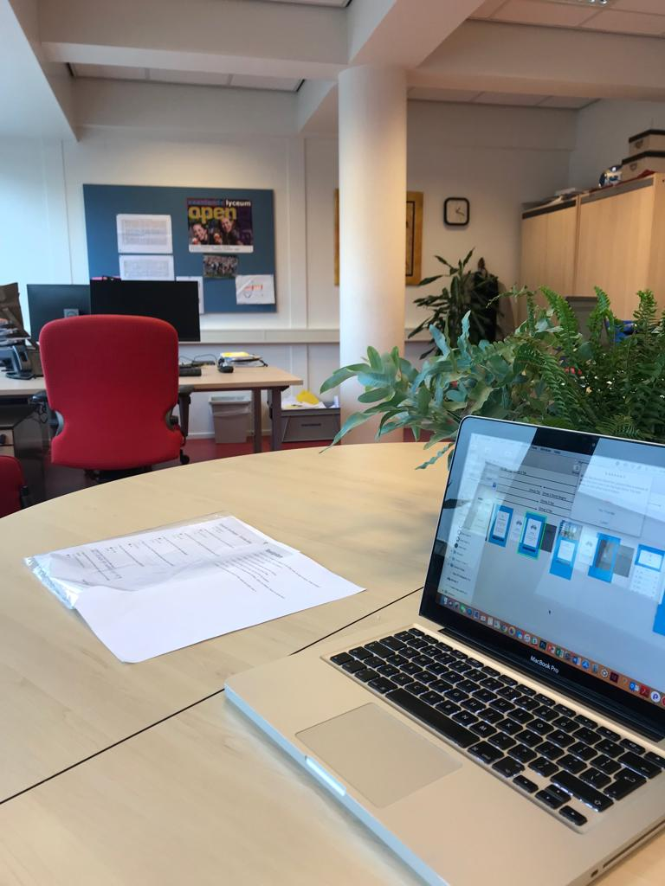

# 4.1.1 Test + Resultaten

Prototype 0.5 heb ik op 14 december getest op twee testpersonen. Mevrouw Landheer had voor mij geregeld dat ik mijn prototype kon testen op twee leerlingen uit de Eerste klas. Het doel van deze kleine test was om feedback te halen op de helderheid van mijn concept en de algemene interactie. Met deze feedback kan ik vervolgens aan de slag gaan met Prototype 0.9. De voorbereiding op de test, de uitwerking van de test zelf en de belangrijkste resultaten zijn terug te vinden op deze pagina.

## Voorbereiding 

Als voorbereiding op de test heb ik het prototype 'werkend' gemaakt in de app Principle. Ik zal de test uitvoeren op mobiel zodat dit gelijk staat aan de 'echte' gebruikerservaring.

Verder heb ik een aantal Job Stories opgesteld die mijn testpersonen tijdens de test kunnen gaan uitvoeren. Ik vroeg de testpersonen daarnaast tijdens te test om hardop te denken zodat ik een beter inzicht kreeg in wat zij op dat moment dachten. Ik heb van de test een geluidsopname gemaakt en de belangrijkste testresultaten per testpersoon zijn terug te vinden op deze pagina. 

### Job Stories  

1. Open de app, probeer in te loggen en de uitleg over de app te lezen. Snap je alles?
2. Begrijp je hoe je het menu moet openen?
3. Ga naar de klassenchat.
4. Probeer een gesprek te starten met jouw mentor.
5. Bekijk het score-overzicht van de gehele klas.
6. Probeer de uitleg over de app nog een keer te bekijken.
7. Het is vrijdag, je kan de Weekly Game spelen. Open de Weekly Game en speel hem.
8. Zet een stap. 
9. Verlaag het aantal stappen dat jij in een week wil zetten naar 3.

## Testresultaten



### Testpersoon 1

1. **Open de app, probeer in te loggen en de uitleg over de app te lezen. Snap je alles?** _Leerling begrijpt hoe het invullen van de code werkt en begrijpt dat je door de uitleg heen moet swipen. Zij geeft aan dat zij dit weet doordat er bolletjes onderin staan. Terug-swipen werkt alleen in het huidige prototype nog niet. Ze begrijpt de uitleg ook. Daarnaast klikt zij ook vanzelf op het kruisje als ik haar vraag om de uitleg af te sluiten._  
2. **Begrijp je hoe je het menu moet openen?**

   _Zij klikt in één keer goed op het hamburger-icon. Ook lukt het haar om het menu vervolgens te sluiten._  

3. **Ga naar de klassenchat.**
4. **Probeer een gesprek te starten met jouw mentor.** _Beide taken gaan in één keer goed. De leerling voert de taken zeer vlot uit._  
5. **Bekijk het score-overzicht van de gehele klas.** _De taak wordt wederom snel uitgevoerd. Wel merk ik dat de leerling ervan uit gaat dat na het klikken op het menu-item het menu vanzelf dichtklapt. Dit is in het huidige prototype nog niet het geval. Ook wil de leerling al naar beneden scrollen om de resultaten van meer leerlingen uit de klas te bekijken, maar dit werkt momenteel nog niet in het huidige prototype._  
6. **Probeer de uitleg over de app nog een keer te bekijken.** _Dit was even zoeken. Ze zag het vraagteken niet gelijk. Ze gaf aan dat een vraagteken op zich wel een duidelijk tekentje is omdat je weet dat je daar meer informatie krijgt, maar de plek is misschien niet helemaal juist._  
7. **Het is vrijdag, je kan de Weekly Game spelen. Open de Weekly Game en speel hem.** _Ze weet gelijk de Weekly Game te starten. Ik geef aan dat ze mag beginnen met spelen en dat lukt. Ze geeft netjes antwoord op de eerste vraag en bij het antwoord valt haar de Emoji op: "Hey, leuk!" zegt ze. Verder merk je dat ze zeer vlot door alle vragen gaat maar telkens wanneer de uitslag in het beeld komt wil ze juist op de grijze overlay klikken om verder te gaan. Die is in het huidige prototype niet klikbaar. Ze geeft aan dat ze daarop wil klikken omdat ze denkt dat ze dan sneller door kan gaan. Zelf komt ze ook met het idee om een knopje te plaatsen met 'Naar de volgende vraag'. Erg nuttige feedback voor mij. Verder geeft ze aan dat alles vrij duidelijk was en dat ze het leuk vond om de Weekly Game te spelen._  
8. **Zet een stap.** _Dit gaat probleemloos. Als ik haar vraag of ze begrijpt wat het slotje op de volgende stap betekent zegt ze "Ik denk dat ik deze stap nog niet kan openen". Wel geeft ze als tip om dit misschien als tekst ook nog erbij te zetten. Dat wanneer je klikt dat er ook een melding komt dat je deze stap nog niet kan zetten._  
9. **Verlaag het aantal stappen dat jij in een week wil zetten naar 3.** 

   _Hmm.. Ze weet dat dit via 'Instellingen' moet maar ze weet nu niet waar die zit. Ik geef haar als tip dat het via de uitleg van de app. Ze geeft aan dat dat misschien niet duidelijk genoeg is en geeft mij de tip dat ik misschien een tandwiel kan neerzetten met 'Instellingen'. Dat is volgens haar wat duidelijker. Hele nuttige feedback voor mij.   
   Ik vraag haar daarnaast ook of ik de uitleg van de app en de instellingen los van elkaar moet weergeven of samen moet laten. Zij geeft aan dat het haar beter lijkt om deze twee dingen los van elkaar weer te geven._ 



### **Testpersoon 2**

1. **Open de app, probeer in te loggen en de uitleg over de app te lezen. Snap je alles?** _Gaat goed. Zij wist ook al door de bolletjes dat zij moest swipen. Ze zei dat zij de bolletjes herkende omdat heel veel apps dit hebben. De uitleg vindt ze duidelijk en ze begrijpt eigenlijk wel hoe alles werkt zegt ze._  
2. **Begrijp je hoe je het menu moet openen?**

   _Doet ze ook foutloos. Ook weet ze hoe ze het menu moet dichtdoen. Wel zegt ze dat het misschien handig is om een kruisje te hebben waarmee je het menu kan afsluiten._  

3. **Ga naar de klassenchat.** _Probleemloos._  
4. **Probeer een gesprek te starten met jouw mentor.** _Snapt ze ook direct. Ze snapt alles zegt ze. Ze vraagt of je in de chat ook Emoji's kan sturen, dit zit uiteraard standaard op het toetsenbord van iOS._ 
5. **Bekijk het score-overzicht van de gehele klas.** _Ze stelt tussendoor voor dat het misschien een goed idee is dat wanneer je op een item uit het menu klikt, dat het menu automatisch inklapt. Dit werd ook door Testpersoon 1 aangegeven, goede feedback._  
6. **Probeer de uitleg over de app nog een keer te bekijken.**  
   _Deze taak kostte haar relatief meer tijd dan de andere taken. Hier is dus zeker ruimte voor verbetering. Ze klikte eerst op het Overzicht voordat ze het vraagteken zag._   

   _Ze vraagt tussendoor of je ook stappen van andere dagen terug kan kijken. Dit kan. Ook vraagt ze hoe het gaat als je bijv. aangeeft dat je in een week 3 stappen wil zetten. Welke dagen zet je dan de stappen? Ze stelt voor dat het misschien het beste is om dit zo gelijk mogelijk over de week te verdelen. Als je 3 stappen zet wordt het dan maandag, woensdag en vrijdag. En als je bijv. 2 stappen zet wordt het dinsdag en vrijdag. En 1 alleen op vrijdag._

7. **Het is vrijdag, je kan de Weekly Game spelen. Open de Weekly Game en speel hem.** _Deze taak ging zeer vlot. Wel merkte ik ook bij dit testpersoon dat zij bij de uitslagen ook steeds op de donkere overlay klikt om naar de volgende vraag te gaan. Toen ik vroeg waarom ze hierop klikte gaf ze aan dat als ze dacht dat ze op de 'achtergrond' zou klikken dat hij weg zou gaan. Een knopje met 'Volgende vraag' lijkt haar een goed idee. Ze vindt de Emoji's bij de vragen heel leuk zegt ze. Ze zou het ook leuk vinden als elk plaatje een andere kleur krijgt bij de vragen want ze houdt van kleuren, zegt ze._  
8. **Zet een stap.** _Gaat goed. Geen moeilijkheden of twijfels. Als ik vraag wat er met het slotje wordt bedoeld zegt ze dat ze dit wel eens vaker heeft gezien in games. Er moet eerst iets gedaan worden voordat je verder kan, denkt ze.  Ze vindt het prettig dat de teksten kort zijn in de stappen. Ze geeft als voorbeeld haar broertje die lezen haat, die leest nooit en wil altijd gelijk het spelletje spelen._ 
9. **Verlaag het aantal stappen dat jij in een week wil zetten naar 3.** 

   _Doordat zij nu weet dat dit via het vraagteken gaat door de vorige jobstory, lukt het. Als ik voorstel om het misschien onder een knopje 'Instellingen' te doen, reageert ze enthousiast, dat lijkt haar ook een beter idee zegt ze._  



## Belangrijkste resultaten

* Menu werkt nog niet helemaal goed. Of er moet een kruisje komen om het menu te sluiten of het menu moet vanzelf dichtgaan als er op een item is geklikt.
* De uitleg van de app is niet makkelijk genoeg terug te vinden. 
* In de Weekly Game moet er na het beantwoorden van een vraag een button komen die de gebruiker naar de volgende vraag leidt. 
* Bij de stappen met een slotje die nog niet beschikbaar zijn moet er ook een korte tekst komen die nogmaals duidelijk maakt dat de stap nog niet beschikbaar is \(en wanneer deze wel beschikbaar wordt\). 
* Het verlagen van de stappen moet via een menu-item Instellingen worden gedaan. 
* Bij het uploaden van een foto moeten de leerlingen ook uit een lijstje met voorgeselecteerde standaardfoto's kunnen kiezen. 

